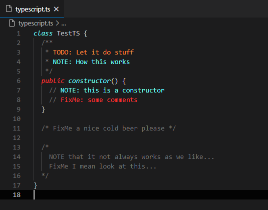
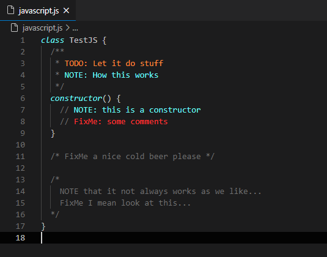
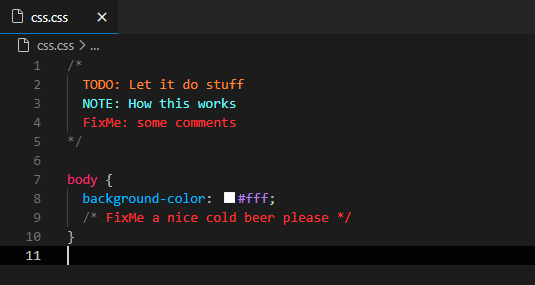

<p>
  <h1 align="center">mint-it</h1>
</p>

<p align="center">
  <a href="https://github.com/squeeble-ink/vscode.deco-it/issues">
    
  </a>
  <a href="https://marketplace.visualstudio.com/items?itemName=squeeble.deco-it">
    
  </a>
  <a href="https://marketplace.visualstudio.com/items?itemName=squeeble.deco-it">
    
  </a>
  <br>
  <a href="https://code.visualstudio.com/" >vscode</a> comment highlighter : just comment it 
</p>

<h1></h1>

The comment higlighter `mint-it` came from our [`trepid-ink`](https://github.com/squeeble-ink/vscode.trepid-ink/edit/master/README.md)

## Features

### Custom comment highlights:

This extension contributes the following settings:

- `mint-it.delay`:  
  Delay it takes to style the comments  
  **NOTE:** Do not set it on 0!
- `mint-it.comments`:  
  `All` / `Block` / `Single` / `No`  
  Sets which comments you want to highlight
- `mint-it.tags`:  
  The ["style" can have all vscode theming](https://code.visualstudio.com/api/references/vscode-api#ThemableDecorationRenderOptions)  
  **NOTE:** tags are not case sensitive
  ```json
  "mint-it.tags": [
    {
      "style": {
        "color": "#6bf7f7"
      },
      "tag": "NOTE"
    },
    {
      "style": {
        "color": "#ff893a"
      },
      "tag": "TODO"
    },
    {
      "style": {
        "color": "#ff3333"
      },
      "tag": "FixMe"
    }
  ]
  ```

### Supported languages

- JavaScript
- JavaScriptReact
- TypeScript
- TypeScriptReact
- CSS
- CPP

### Examples

  
  
  

